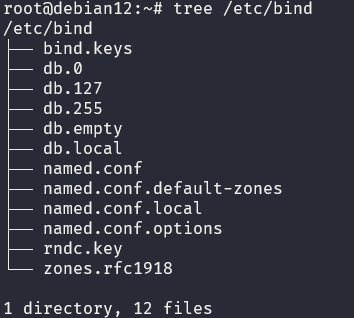
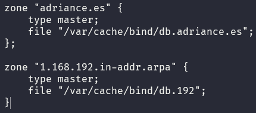
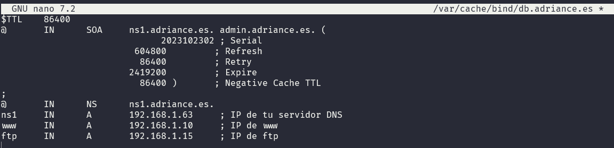
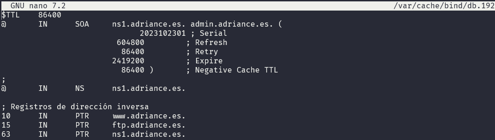
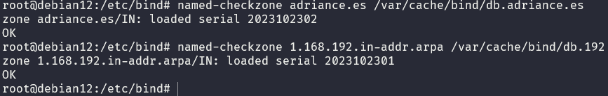
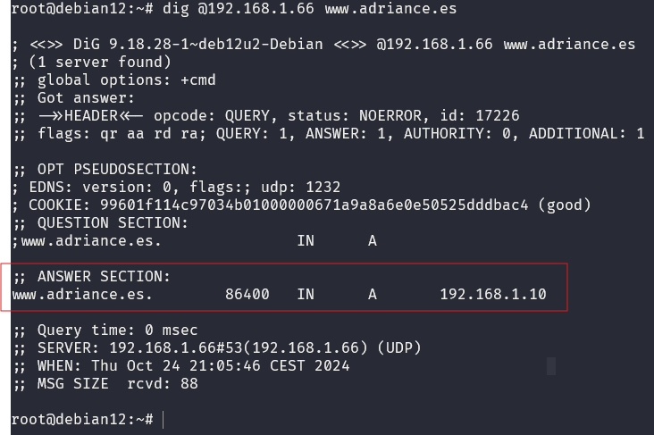
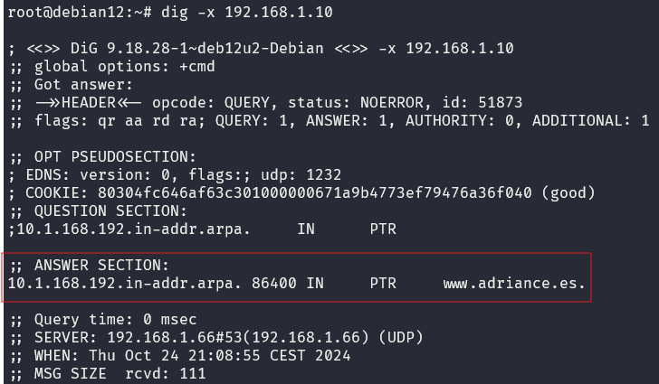
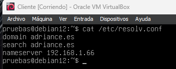
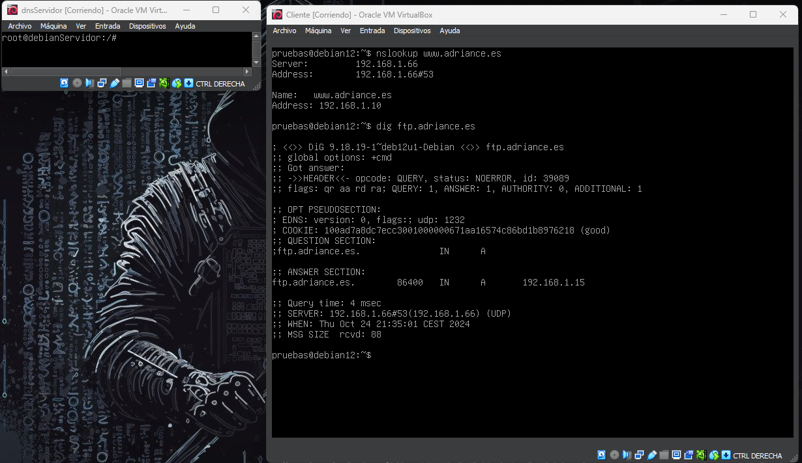

Esto es un repositorio para explicar la configuración de DNS con bind9 en distribuciones de Linux. 

## ¿Qué es DNS?
DNS (Domain Name System) es un sistema de nomenclatura jerárquica para computadoras, servicios o cualquier recurso conectado a Internet o a una red privada. Este sistema asocia información variada con nombres de dominio asignados a cada uno de los participantes. Su función más importante es traducir (resolver) nombres inteligibles para las personas en identificadores binarios asociados con los equipos conectados a la red, esto con el propósito de poder localizar y direccionar estos equipos mundialmente.

## Conceptos básicos de DNS

- **Zona**: Es un espacio de nombres en el DNS. Cada zona es un dominio de nivel superior en el árbol de nombres de dominio y contiene información sobre un dominio específico. Las zonas se dividen en dos tipos: zonas directas e inversas.
- **Zona directa**: Es una zona que mapea nombres de dominio a direcciones IP.
- **Zona inversa**: Es una zona que mapea direcciones IP a nombres de dominio.
- **Registro A**: Es un tipo de registro de recursos en el DNS que se utiliza para asociar un nombre de dominio con una dirección IP.
- Esclavo: Es un servidor DNS que obtiene información de una zona de un servidor maestro.Balancea la carga de trabajo del servidor maestro y asegura la alta disponibilidad.

## ¿Qué es BIND9?

BIND (Berkeley Internet Name Domain) es un software de servidor de nombres de dominio de código abierto y gratuito. Es el software de servidor de nombres de dominio más utilizado en Internet, especialmente en sistemas Unix-like, donde es un componente de la mayoría de las implementaciones de servidores DNS.

## Stack

- MV: Debian 12
- DNS: Bind9
> [!NOTE]
> vamos a simular un escenario donde tenemos un servidor DNS con la dirección IP: 192.168.1.65/24. Se recomienda usar una red interna para tener un entorno controlado.

## Instalación de Bind9

Para instalar bind9 en Debian, ejecutamos el siguiente comando:

```bash
 apt update &&  apt install bind9 -y
```

Nos vamos a conectar por ssh a nuestra maquina para poder configurar el servidor DNS.

```bash
ssh usuario@192.168.1.65
```
Una vez instalado el servicio, los archivos de configuración se encuentran en la ruta `/etc/bind/`.



## Configuración de Bind9

Archivos importantes:

- `/etc/bind/named.conf.local`: Archivo de configuración de las zonas locales.
- `/etc/bind/named.conf.options`: Archivo de configuración de las opciones del servidor.
- `/etc/bind/db.empy`: Archivo de configuración de la zona directa.
- `/etc/bind/db.192`: Archivo de configuración de la zona inversa.

### Configuración de las zonas

Para configurar las zonas, editamos el archivo con nano `/etc/bind/named.conf.local` y agregamos las zonas directa e inversa.
> [!WARNING]
> si vemos el fichero `/etc/bind/named.conf.options` , vemos que el directorio de trabajo es /var/cache/bind, por eso nuestra zona apunta a ese directorio.



Mi zona va a ser adriance.es y mi zona inversa va a ser 1.168.192.in-addr.arpa, el tipo de zona  es master y el fichero al que apunta /var/cache/bind/db.adriance.es. y  /var/cache/bind/db.192.

Para crear los ficheros de cada zona, copiamos los ficheros de ejemplo que vienen en la carpeta `/etc/bind/` y los renombramos.

```bash
 cp /etc/bind/db.empty /var/cache/bind/db.adriance.es # zona directa
 cp /etc/bind/db.127 /var/cache/bind/db.192 # zona inversa
```

Editamos el fichero con nano `/var/cache/bind/db.adriance.es` y agregamos los registros de la zona directa. En mi caso voy a probar con 3 registros www,ftp y ns1.



Hemos modificado la plantilla con los registros que necesitamos, ahora vamos a modificar el fichero de la zona inversa `/var/cache/bind/db.192` y agregamos los registros de la zona inversa.



## Validación de la configuración

Para validar la configuración, ejecutamos el siguiente comando:

```bash
 named-checkconf
 named-checkzone adriance.es /var/cache/bind/db.adriance.es
 named-checkzone 1.168.192.in-addr.arpa /var/cache/bind/db.192
```
> [!TIP]

> Es probable que de algún error, como consejo podemos hacer nano +nº_linea /ruta/fichero para ver la linea que nos da error y corregirlo.

> [!WARNING]
No olvidar reiniciar el servicio para que los cambios surtan efecto.

```bash
systemctl restart bind9
systemctl status bind9
```

## Comprobar la resolución de nombres

Es conveniente configurar y comprobar el archivo /etc/resolv.conf donde añadiremos la dirección IP de nuestro servidor DNS.
```bash
echo "nameserver mi_ip" > /etc/resolv.conf
```
> [!TIP]
> sustituye mi_ip por la dirección IP de tu servidor DNS.Si renicas la maquina, este fichero se perderá y lo tienes que volver a configurar.


Para comprobar que la resolución de nombres funciona correctamente, ejecutamos el siguiente comando:

```bash
nslookup www.adriance.es
nslookup ftp.adriance.es
nslookup ns1.adriance.es
```
> [!TIP]
> sustituye adriance.es por tu dominio.

Para ver una mejor traza de la resolución de nombres, podemos usar el comando dig.

```bash
#zona directa
dig @mi_ip www.tudominio.es
```


```bash
#zona inversa
dig -x mi_ip
```



# Probando con un cliente

Voy a utilzar una .ova que tengo para hacer pruebas, la voy a conectar a la red interna y le voy a poner la dirección IP del servidor DNS con el comando echo "nameserver mi_ip" > /etc/resolv.conf.



Estoy con el usuario pruebas en mi cliente y al establecer mis dns con la dirección IP de mi servidor DNS, puedo hacer ping a los registros que he creado en mi servidor DNS y resolverlos.



vemos que resuelve los nombres que hemos creado en nuestro servidor DNS.
